# ----------------------------------------------------------

<h1 align='center'> SassTask </h1>

# ----------------------------------------------------------


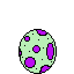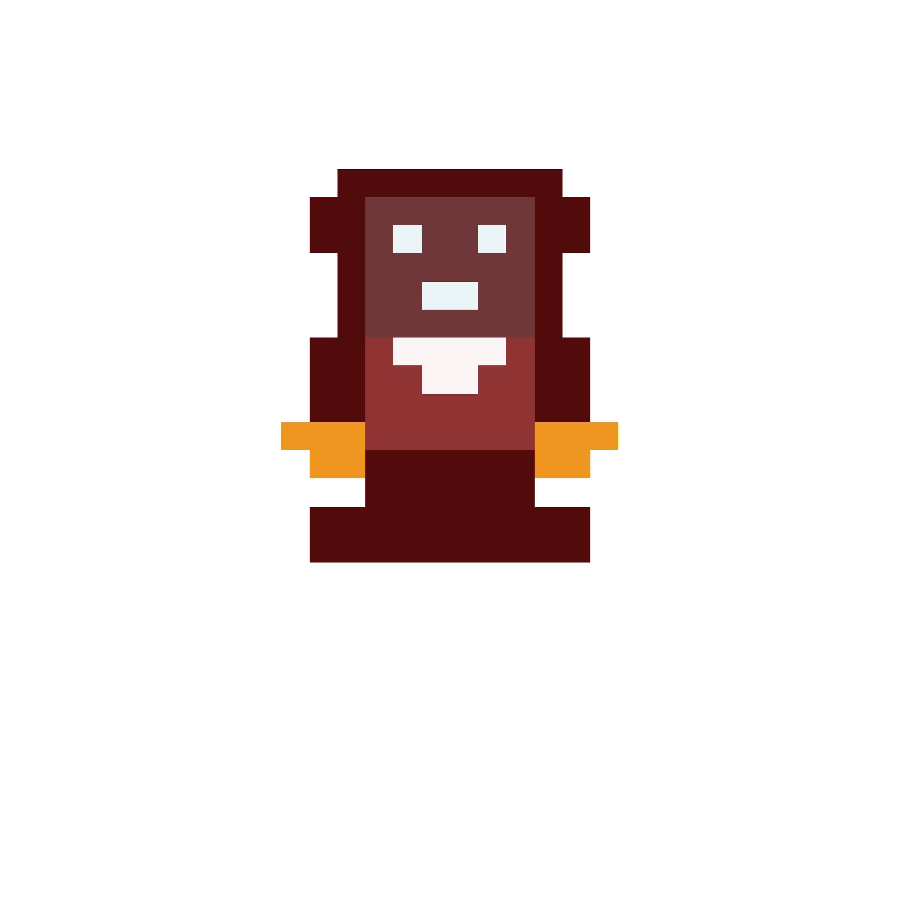 

This is our final project for Makers Academy.


The goal of this mobile app is to create a todo list and habit manager whereby you can track daily tasks/chores. Your success in completing/failing these tasks will have a direct effect for the monster which you care for, similar to a tamagotchi. Completing tasks will feed the monster, while failing to complete tasks will have a negative effect on your monster.


## To Run This App

Clone this repo by running:
```
git clone git@github.com:day-katy/SassTask.git
```
Change into the Sasstask directory:
```
cd SassTask
```
Install dependencies with Yarn
```
yarn
```
Run expo start to begin the app simulation
```
expo start
```
You may then run the app either with a local android/iphone simulator, within your web browser or with your own code following the instructions below:

#### Android user:
To use this app on Android:
- Run expo start in your terminal
```
expo start
```
- Install the ExpoGo app on your android.
- scan the barcode with your phone camera.

#### Iphone user:
To use this app on Iphone:
- Run expo start in your terminal
```
expo start
```
- Install the ExpoGo app on your iphone.
- scan the barcode with your phone camera.

## Technology:

This app is built with React native. The database is built using Firebase.

## Wireframe
Here is the initial wireframe design of our app:
https://wireframe.cc/pro/pp/21df94671423933

Homepage:

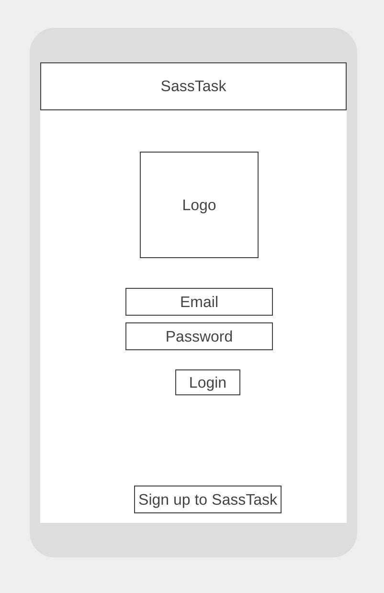

Todo List:


SasSquash page:

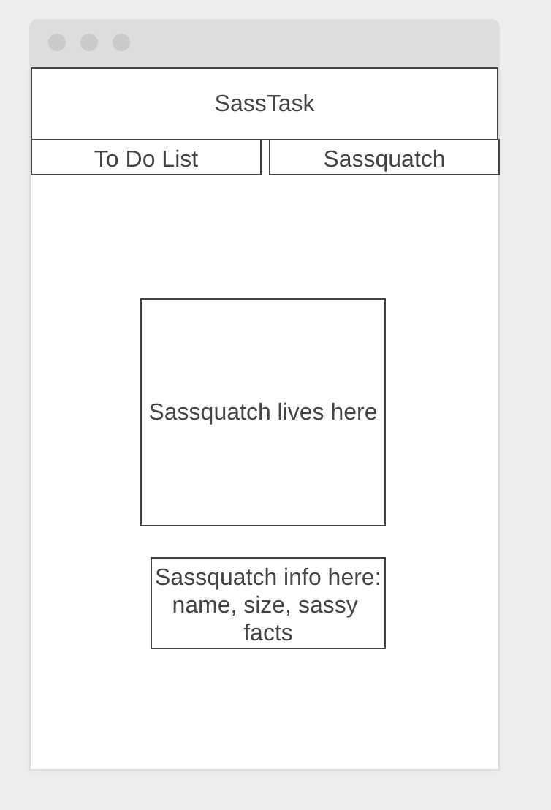

Task page:

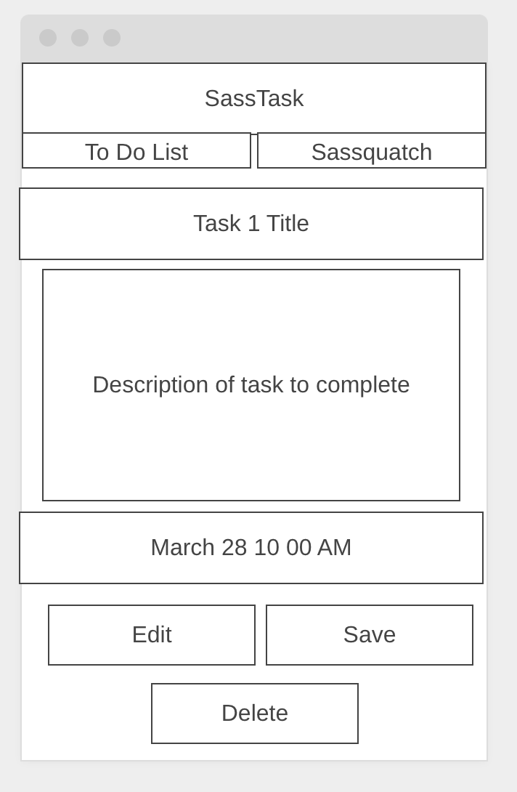

### MVP User Stories

```
As a sassquatch who has a thing to get done,
so I can remember what I need to get done,
I would like to create a task that I need to do.

As a sassquatch who has a thing to get done,
so I can see what I need to get done,
I would like to see the task that I need to do.

As a sassquatch who has a whole ton of stuff to get done,
so I can remember how incredibly busy I am,
I would like to create multiple tasks that I need to do.

As a sassquatch who has a whole ton of stuff to get done,
so I can see how incredibly busy I am,
I would like to see the multiple tasks that I need to do.

As a sassquatch who is extremely goal driven,
so I can see what tasks I have actually accomplished,
I would like to check off tasks as being completed.

As a sassquatch who is just as human as the next person,
so I can mark tasks that I haven't completed,
I would like to mark tasks as not being completed.

As a sassquatch who is a neat-freak,
so I can only see the tasks that I still need to do,
I would like tasks that I've marked to disappear.

As a sassquatch who needs a lot of validation,
so I can get feedback that is appropriate to finishing a task,
I would like celebratory visual and verbal recognition of my accomplishments.

As a sassquatch that needs a kick up the arse,
so I can get feedback that is appropriate to not completing a task,
I would like sassy and slightly derogatory recognition of my failure.

```

### Further User Stories

```
As a private and reclusive sassquatch,
so I can have my own to do list that no one else can see,
I would like to be able to sign up to SassTask.

As a private and reclusive sassquatch,
so I can have my own to do list that no one else can see,
I would like to be able to log in to SassTask.

As a sassquatch who is incredibly fickle,
so I can change some of the stuff that I've said I need to do,
I would like to edit the tasks that I have created.

As a sassquatch who is sometimes lazy,
so I can get rid of some stuff that I've said I need to do,
I would like to delete specific tasks I have created.

As an organized sassquatch,
so I can see what tasks I have completed,
I would like to see a separate list of my completed tasks.

As a sassquatch that has a schedule to keep,
so I can keep track of when things need to be completed,
I would like to be able to set deadlines for tasks.

As a sassquatch who has an eye on the longterm future,
so I can keep tabs on my overarching goals,
I would like to have a separate list for long-term ambitions.

As a sassquatch who likes cute animations,
so I can feel a rush of dopamine to my large heaad,
I would like to have a creature whose health is tied to how good I am at accomplishing my to do list.

As a sassquatch who needs constant validation,
so I can continue to have increased rushes of dopamine,
I would like my creature to be able to grow/evolve when I am super good at my to do list.

As a sassquatch who needs a bigger kick up the arse,
so I can get slightly depressed about not doing stuff,
I would like my creature to regress/die when I am terrible at my to do list.

As a sassquatch who doesn't have the best memory for deadlines,
so I can get some help with that,
I would like my phone to send me reminders about impending doom (deadlines).

As a sassquatch who has trouble keeping fit,
so I can keep track of my fitness in a sassy way,
I would like to link my FitBit to my SassTask app.
```

## Current Test Coverage

To run our tests run the following command in your terminal:
```
yarn test
```
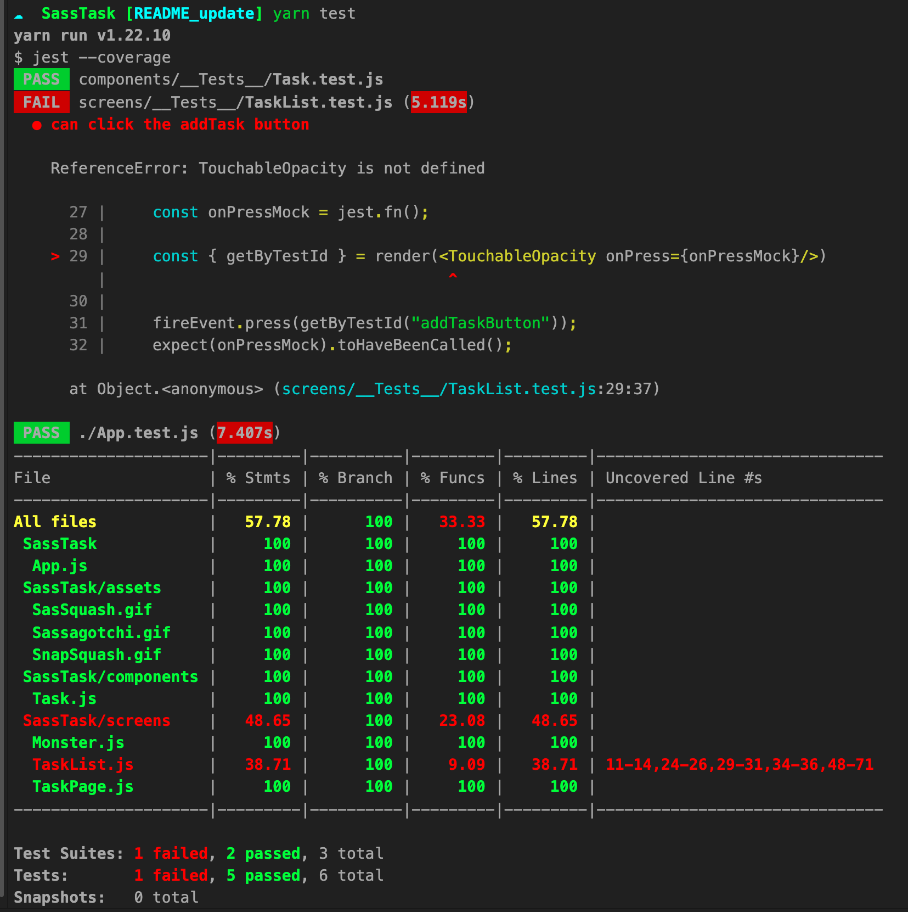
Currently all tests are passing with 100% Coverage.

## Tests to Implement

* You can add a task
* You can add more than one task and see them all
* You can complete a task
* Completing a task will remove it from the page
* You can mark a task as incomplete
* You can delete a task
* Your monster will provide feedback when you complete a task
* Your monster will provide feedback if you do not complete a task
* You can update a task

## Features Implemented
Here is a list of the currently implemented features on SassTask:

* You can add tasks:

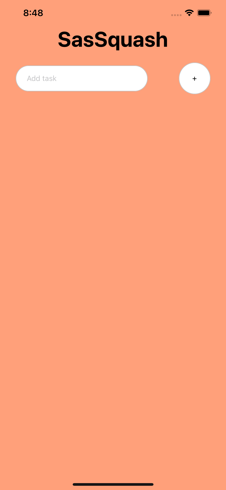 <text> ---> </text>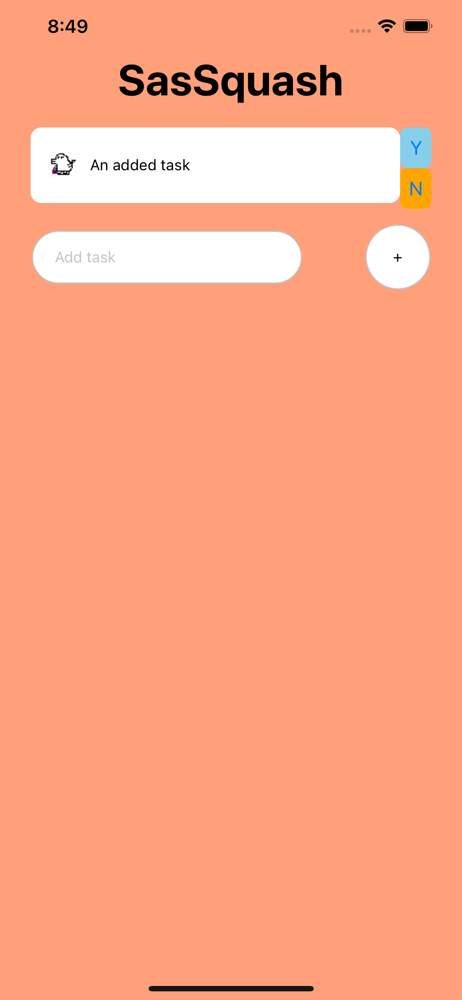

* You can see a list of tasks:

 <text> ---> </text>< img src="assets/TaskList.png" height='500'>

* You can complete tasks: 

 <text> ---> </text>  <text> ---> </text> 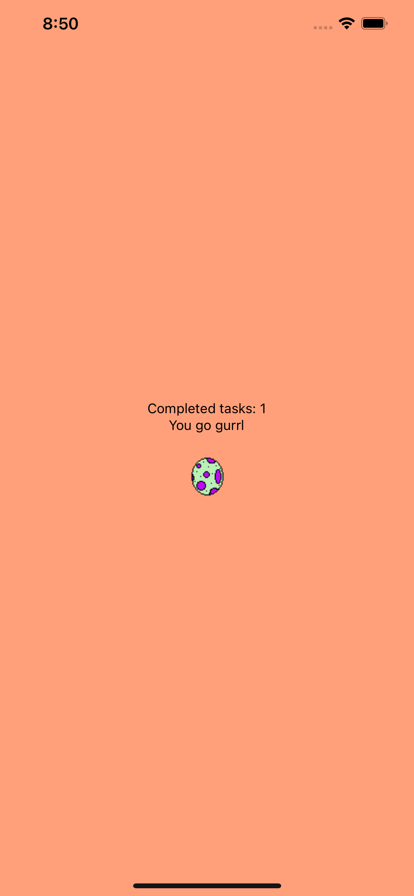

* You can mark tasks as incomplete: 

 <text> ---> </text>  <text> ---> </text> 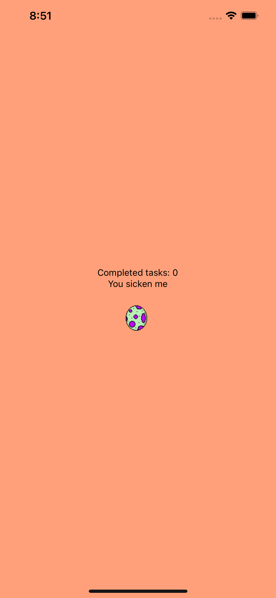

* You can delete tasks: 

 <text> ---> </text>  <text> ---> </text> 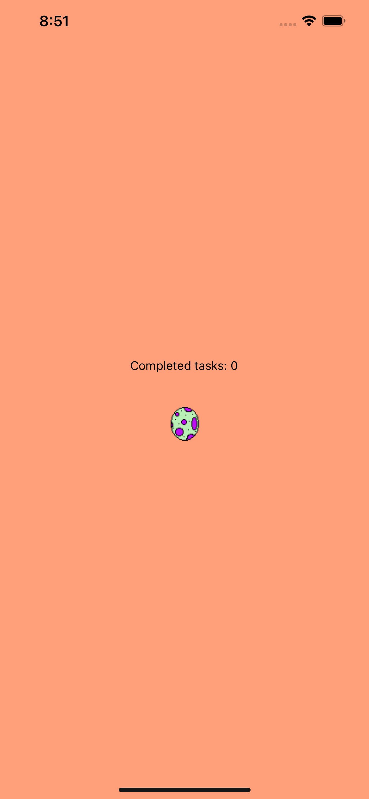

* Your monster will provide feedback when you complete tasks: 

 <text> ---> </text>  <text> ---> </text> 

* Your monster will provide feedback when you do not complete tasks: 

 <text> ---> </text>  <text> ---> </text> 

* Your monster will die if you do not complete enough tasks: 

* Your monster will ascend if you complete enough tasks: 

## Features to be implemented

* You can get a new monster when your monster dies/moves on

* You can keep track of completed/failed tasks

* You can see stats of how well you are doing

## Planning
Here is a link to our trello board:  
https://trello.com/b/rr9Ps79i/sasstask
